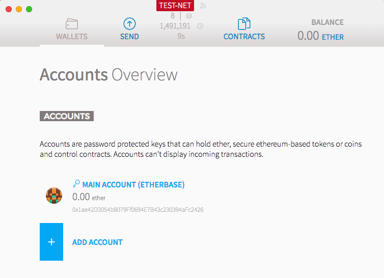
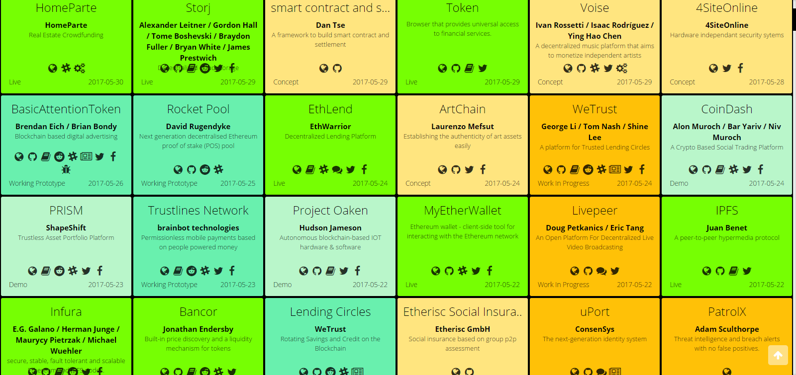

## 相关工具

### 客户端和开发库

以太坊客户端可用于接入以太坊网络，进行账户管理、交易、挖矿、智能合约等各方面操作。

以太坊社区现在提供了多种语言实现的客户端和开发库，支持标准的 JSON-RPC 协议。用户可根据自己熟悉的开发语言进行选择。

* [go-ethereum](https://github.com/ethereum/go-ethereum)：Go 语言实现；
* [Parity](https://github.com/ethcore/parity)：Rust 语言实现；
* [cpp-ethereum](https://github.com/bobsummerwill/cpp-ethereum)：C++ 语言实现；
* [ethereumjs-lib](https://github.com/ethereumjs/ethereumjs-lib)：javascript 语言实现；
* [Ethereum(J)](https://github.com/ethereum/ethereumj)：Java 语言实现；
* [ethereumH](https://github.com/blockapps/ethereumH)：Haskell 语言实现；
* [pyethapp](https://github.com/ethereum/pyethapp)：Python 语言实现；
* [ruby-ethereum](https://github.com/janx/ruby-ethereum)：Ruby 语言实现。

#### Geth

上述实现中，go-ethereum 的独立客户端 Geth 是最常用的以太坊客户端之一。

用户可通过安装 Geth 来接入以太坊网络并成为一个完整节点。Geth 也可作为一个 HTTP-RPC 服务器，对外暴露 JSON-RPC 接口，供用户与以太坊网络交互。

Geth 的使用需要基本的命令行基础，其功能相对完整，源码托管于 github.com/ethereum/go-ethereum。

### 以太坊钱包

对于只需进行账户管理、以太坊转账、DApp 使用等基本操作的用户，则可选择直观易用的钱包客户端。

Mist 是官方提供的一套包含图形界面的钱包客户端，除了可用于进行交易，也支持直接编写和部署智能合约。

所编写的代码编译发布后，可以部署到区块链上。使用者可通过发送调用相应合约方法的交易，来执行智能合约。

### IDE

对于开发者，以太坊社区涌现出许多服务于编写智能合约和 DApp 的 IDE，例如：

* [Truffle](http://truffleframework.com/)：一个功能丰富的以太坊应用开发环境。
* [Embark](https://github.com/iurimatias/embark-framework)：一个 DApp 开发框架，支持集成以太坊、IPFS 等。
* [Remix](http://remix.ethereum.org)：一个用于编写 Solidity 的 IDE，内置调试器和测试环境。

### 网站资源

已有一些网站提供对以太坊网络的数据、运行在以太坊上的 DApp 等信息进行查看，例如：

* ethstats.net：实时查看网络的信息，如区块、价格、交易数等。
* ethernodes.org：显示整个网络的历史统计信息，如客户端的分布情况等。
* dapps.ethercasts.com：查看运行在以太坊上的 DApp 的信息，包括简介、所处阶段和状态等。

