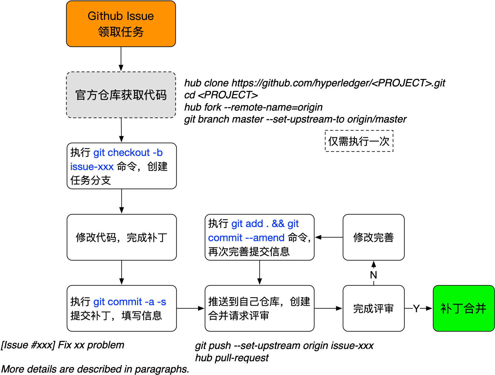

## 贡献代码

超级账本的各个子项目，都提供了十分丰富的开发和提交代码的指南和文档，一般可以在代码的 `docs` 目录下找到。部分项目（如 Fabric 和 Cello）使用了社区自建的代码管理和评审方案，其他项目多数直接使用 Github 来管理流程。

这里以 Fabric 项目为例进行讲解。

### 安装环境

推荐在 Linux（如 Ubuntu 18.04+）或 MacOS 环境中开发 Hyperledger 项目代码。

不同项目会依赖不同的环境，可以从项目文档中找到。以 Fabric 项目为例，开发需要安装如下依赖。

* Git：用来从 Gerrit 仓库获取代码并进行版本管理。
* Golang 1.10+：访问 golang.org 进行安装，之后需要配置 `$GOPATH` 环境变量。注意不同项目可能需要不同语言环境。
* Docker 1.18+：用来支持容器环境，MacOS 下推荐使用 [Docker for Mac](https://docs.docker.com/docker-for-mac)。

### 获取代码

首先注册 Linux Foundation ID（LF ID），如果没有可以到 https://identity.linuxfoundation.org/ 进行免费注册。

使用 LF ID 登陆 [https://gerrit.hyperledger.org/](https://gerrit.hyperledger.org/)，在配置页面（https://gerrit.hyperledger.org/r/#/settings/ssh-keys），添加个人 ssh Pub key，否则每次访问仓库需要手动输入用户名和密码。

查看项目列表，找到对应项目，采用 `Clone with commit-msg hook` 的方式来获取源码。

以 Fabric 项目为例，按照 Go 语言推荐代码结构，执行如下命令拉取代码，放到 `$GOPATH/src/github.com/hyperledger/` 路径下，其中 `LF_ID` 替换为用户个人的 Linux Foundation ID。

```sh
$ mkdir $GOPATH/src/github.com/hyperledger/
$ cd $GOPATH/src/github.com/hyperledger/
$ git clone ssh://LF_ID@gerrit.hyperledger.org:29418/fabric && scp -p -P 29418 LF_ID@gerrit.hyperledger.org:hooks/commit-msg fabric/.git/hooks/
```

如果没有添加个人 ssh pubkey，则可以通过 http 方式 clone，此时需要手动输入用户名和密码信息。

```sh
$ git clone http://LF_ID@gerrit.hyperledger.org/r/fabric && (cd fabric && curl -kLo `git rev-parse --git-dir`/hooks/commit-msg http://LF_ID@gerrit.hyperledger.org/r/tools/hooks/commit-msg; chmod +x `git rev-parse --git-dir`/hooks/commit-msg)
```

如果是首次使用 Git，可能还会提示配置默认的用户名和 Email 地址等信息。通过如下命令进行简单配置即可。

```bash
$ git config user.name "your name"
$ git config user.email "your email"
```

### 编译和测试

大部分编译和安装过程都可以利用 Makefile 来执行，具体以项目代码为准。以 Fabric 项目为例，包括如下常见操作。

#### 安装 go tools
执行如下命令。

```sh
$ make gotools
```

#### 语法格式检查

执行如下命令。

```sh
$ make linter
```

#### 编译 peer

执行如下命令。

```sh
$ make peer
```

会自动编译生成 Docker 镜像，并生成本地 peer 可执行文件。

*注意：有时候会因为获取安装包不稳定而报错，需要执行 `make clean`，然后再次执行。*

#### 生成 Docker 镜像
执行如下命令。

```sh
$ make images
```

#### 执行所有的检查和测试
执行如下命令。

```sh
$ make checks
```

#### 执行单元测试

执行如下命令。 

```sh
$ make unit-test
```

如果要运行某个特定单元测试，则可以通过类似如下格式。

```sh
$ go test -v -run=TestGetFoo
```

#### 执行 BDD 测试
需先生成本地 Docker 镜像。

执行如下命令。 

```sh
$ make behave
```

### 提交代码

仍然使用 LF ID 登录 [jira.hyperledger.org](http://jira.hyperledger.org)，查看有没有未分配（unassigned）的任务，如果对某个任务感兴趣，可以添加自己为任务的 assignee。任何人都可以自行创建新的任务。

初始创建的任务处于 `TODO` 状态；开始工作后可以标记为 `In Progress` 状态；提交对应补丁后需要更新为 `In Review` 状态；任务完成后更新为 `Done` 状态。

如果希望完成某个任务（如 FAB-XXX），则对于前面 Clone 下来的代码，本地创建新的分支 FAB-XXX。

```sh
$ git checkout -b FAB-XXX
```

实现任务代码，完成后，执行语法格式检查和测试等，确保所有检查和测试都通过。

提交代码到本地仓库。

```sh
$ git commit -a -s
```

会自动打开一个编辑器窗口，需要填写 commit 信息，格式一般要求为：

```bash
[FAB-XXX] Quick brief on the change

This pathset fixes a duplication msg bug in gossip protocol.

A more detailed description can be here, with several paragraphs and 
sentences, including issue to fix, why to fix, what is done in the 
patchset and potential remaining issues...
```

提交消息中要写清楚所解决的问题、为何进行修改、主要改动内容、遗留问题等，并且首行宽不超过 50 个字符，详情段落行宽不要超过 72 个字符。

如果是首次往官方仓库提交代码，需要先配置 `git review`，根据提示输入所需要的用户名密码等。

```bash
$ git review -s
```

验证通过后可以使用 git review 命令推送到远端仓库，推送成功后会得到补丁的编号和访问地址。

```sh
$ git review
```

例如：

```bash
$ git review
remote: Processing changes: new: 1, refs: 1, done
remote:
remote: New Changes:
remote:   http://gerrit.hyperledger.org/r/YYY [FAB-XXX] Fix some problem
remote:
To ssh://gerrit.hyperledger.org:29418/fabric.git
 * [new branch]      HEAD -> refs/publish/master/FAB-XXX
```

### 评审代码

提交成功后，可以打开 [gerrit.hyperledger.org/r/](https://gerrit.hyperledger.org/r/)，查看自己最新提交的 patchset 信息。新提交的 patchset 会自动触发 CI 的测试任务，测试都通过后可邀请项目的维护者（maintainer）们进行评审。为了引起关注，可将链接添加到对应的 Jira 任务，并在 RocketChat 上的项目频道贴出。

*注：手动触发某个 CI 测试任务可以通过 Run <Task> 命令，例如重新运行单元测试可以使用 Run UnitTest。*

如果评审通过，则会被合并到主分支。否则还需要针对审阅意见进一步的修正。修正过程跟提交代码过程类似，唯一不同是提交的时候添加 `-a --amend` 参数。

```sh
$ git commit -a --amend
```

表示这个提交是对旧提交的一次修订。

一般情况下，为了方便评审，尽量保证每个 patchset 完成的改动不要太多（最好不要超过 200 行），并且实现功能要明确，集中在对应 Jira 任务定义的范围内。

### 完整流程



总结下，完整的流程如上图所示，开发者用 git 进行代码的版本管理，用 gerrit 进行代码的评审合作。

如果需要修复某个提交补丁的问题，则通过 `git commit -a --amend` 进行修复，并作为补丁的新版本再次提交审阅。每次通过 `git review` 提交时，应当通过 `git log` 查看确保本地只有一条提交记录。

