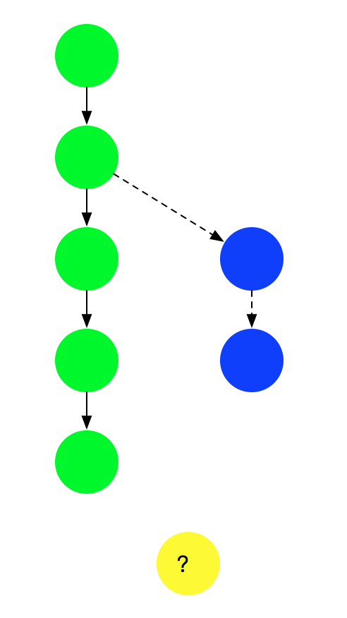

## 共识机制

比特币网络是完全公开的，任何人都可以匿名接入，因此共识协议的稳定性和防攻击性十分关键。

比特币区块链采用了 Proof of Work（PoW）的机制来实现共识，该机制最早于 1998 年在 [B-money](http://www.weidai.com/bmoney.txt) 设计中提出。

目前，Proof of X 系列中比较出名的一致性协议包括 PoW、PoS 和 DPoS 等，都是通过经济惩罚来限制恶意参与。

### 工作量证明

工作量证明，通过计算来猜测一个数值（nonce），使得拼凑上交易数据后内容的 Hash 值满足规定的上限（来源于 hashcash）。由于 Hash 难题在目前计算模型下需要大量的计算，这就保证在一段时间内，系统中只能出现少数合法提案。反过来，能够提出合法提案，也证明提案者确实已经付出了一定的工作量。

同时，这些少量的合法提案会在网络中进行广播，收到的用户进行验证后，会基于用户认为的最长链基础上继续难题的计算。因此，系统中可能出现链的分叉（Fork），但最终会有一条链成为最长的链。

Hash 问题具有不可逆的特点，因此，目前除了暴力计算外，还没有有效的算法进行解决。反之，如果获得符合要求的 nonce，则说明在概率上是付出了对应的算力。谁的算力多，谁最先解决问题的概率就越大。当掌握超过全网一半算力时，从概率上就能控制网络中链的走向。这也是所谓 `51%` 攻击的由来。

参与 PoW 计算比赛的人，将付出不小的经济成本（硬件、电力、维护等）。当没有最终成为首个算出合法 nonce 值的“幸运儿”时，这些成本都将被沉没掉。这也保障了，如果有人尝试恶意破坏，需要付出大量的经济成本。也有设计试图将后算出结果者的算力按照一定比例折合进下一轮比赛考虑。

有一个很直观的超市付款的例子，可以说明为何这种经济博弈模式会确保系统中最长链的唯一性。

假定超市只有一个出口，付款时需要排成一队，可能有人不守规矩要插队。超市管理员会检查队伍，认为最长的一条队伍是合法的，并让不合法的分叉队伍重新排队。新到来的人只要足够理智，就会自觉选择最长的队伍进行排队。这是因为，看到多条链的参与者往往认为目前越长的链具备越大的胜出可能性，从而更倾向于选择长的链。

### 权益证明

权益证明（Proof of Stake，PoS），最早在 2013 年被提出，最早在 [Peercoin]() 系统中被实现，类似现实生活中的股东机制，拥有股份越多的人越容易获取记账权（同时越倾向于维护网络的正常工作）。

典型的过程是通过保证金（代币、资产、名声等具备价值属性的物品即可）来对赌一个合法的块成为新的区块，收益为抵押资本的利息和交易服务费。提供证明的保证金（例如通过转账货币记录）越多，则获得记账权的概率就越大。合法记账者可以获得收益。

PoS 试图解决在 PoW 中大量资源被浪费的缺点，受到了广泛关注。恶意参与者将存在保证金被罚没的风险，即损失经济利益。

一般的，对于 PoS 来说，需要掌握超过全网 1/3 的资源，才有可能左右最终的结果。这个也很容易理解，三个人投票，前两人分别支持一方，这时候，第三方的投票将决定最终结果。

PoS 也有一些改进的算法，包括授权股权证明机制（DPoS），即股东们投票选出一个董事会，董事会中成员才有权进行代理记账。这些算法在实践中得到了不错的验证，但是并没有理论上的证明。

2017 年 8 月，来自爱丁堡大学和康涅狄格大学的 Aggelos Kiayias 等学者在论文《Ouroboros: A Provably Secure Proof-of-Stake Blockchain Protocol》中提出了 Ouroboros 区块链共识协议，该协议可以达到诚实行为的近似纳什均衡，认为是首个可证实安全的 PoS 协议。

