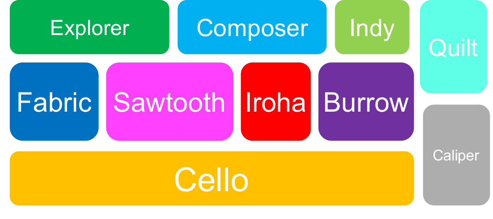
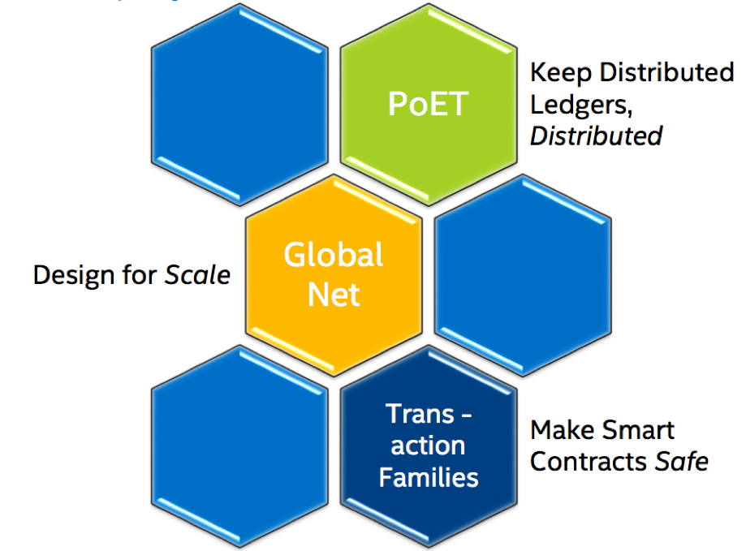
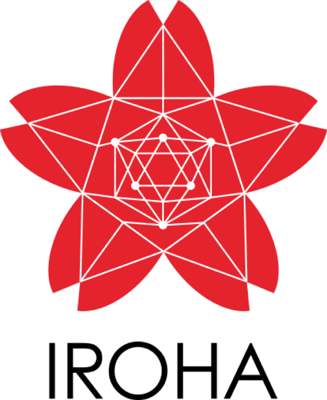
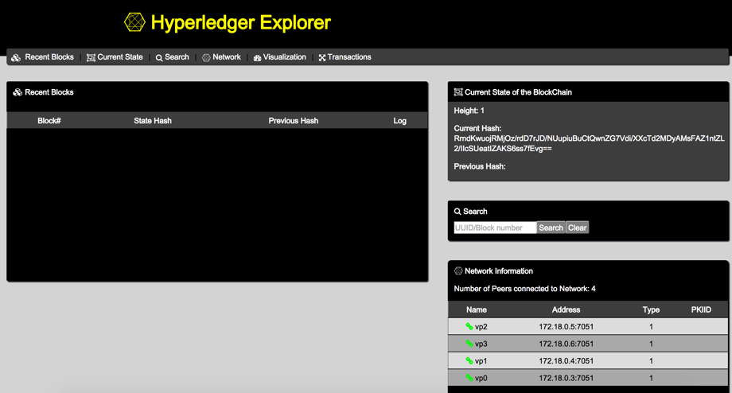
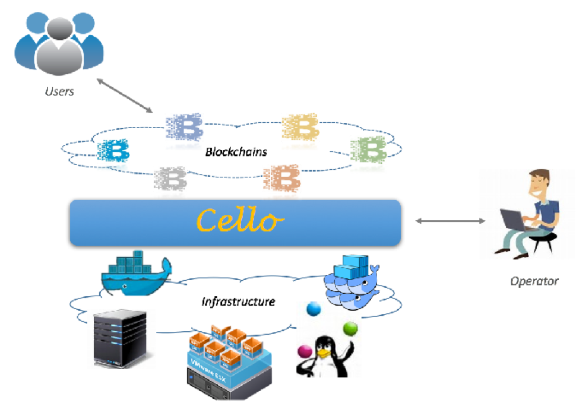
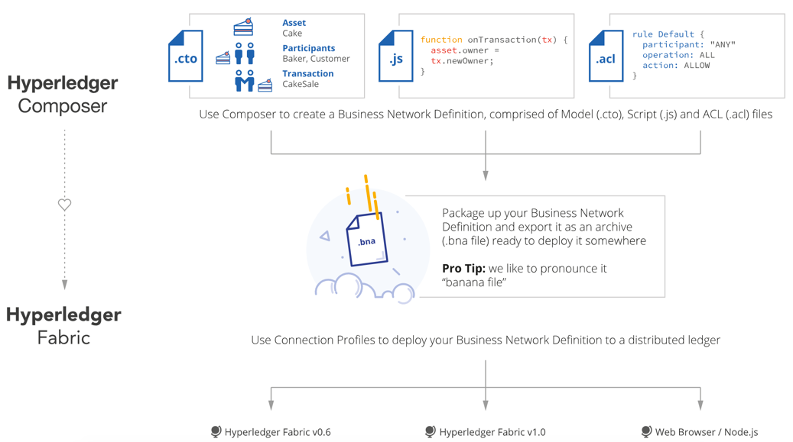

## 顶级项目介绍

Hyperledger 所有项目代码托管在 [Gerrit](https://gerrit.hyperledger.org) 和 [Github](https://github.com/hyperledger/)（只读，自动从 gerrit 上同步）上。

目前，主要包括如下顶级项目。

* [Fabric](https://github.com/hyperledger/fabric)：包括 [Fabric](https://github.com/hyperledger/fabric)、[Fabric CA](https://github.com/hyperledger/fabric-ca)、Fabric SDK（包括 Node.Js、Python 和 Java 等语言）和 [fabric-api](https://github.com/hyperledger/fabric-api) 等，目标是区块链的基础核心平台，支持 PBFT 等新的共识机制，支持权限管理，最早由 IBM 和 DAH 发起；
* [Sawtooth](https://github.com/hyperledger/sawtooth-core)：包括 arcade、[core](https://github.com/hyperledger/sawtooth-core)、dev-tools、[validator](https://github.com/hyperledger/sawtooth-validator)、mktplace 等。是 Intel 主要发起和贡献的区块链平台，支持全新的基于硬件芯片的共识机制 Proof of Elapsed Time（PoET）。
* [Iroha](https://github.com/hyperledger/Iroha)：账本平台项目，基于 C++ 实现，带有不少面向 Web 和 Mobile 的特性，主要由 Soramitsu 发起和贡献。
* [Blockchain Explorer](https://github.com/hyperledger/blockchain-explorer)：提供 Web 操作界面，通过界面快速查看查询绑定区块链的状态（区块个数、交易历史）信息等，由 DTCC、IBM、Intel 等开发支持。
* [Cello](https://github.com/hyperledger/cello)：提供区块链平台的部署和运行时管理功能。使用 Cello，管理员可以轻松部署和管理多条区块链；应用开发者可以无需关心如何搭建和维护区块链，由 IBM 团队发起。
* [Indy](https://github.com/hyperledger/indy)：提供基于分布式账本技术的数字身份管理机制，由 Sovrin 基金会发起。
* [Composer](https://github.com/hyperledger/composer)：提供面向链码开发的高级语言支持，自动生成链码代码等，由 IBM 团队发起并维护。
* [Burrow](https://github.com/hyperledger/burrow)：提供以太坊虚拟机的支持，实现支持高效交易的带权限的区块链平台，由 Monax 公司发起支持。

这些顶级项目相互协作，构成了完善的生态系统，如下图所示。

所有项目一般都需要经历提案（Proposal）、孵化（Incubation）、活跃（Active）、退出（Deprecated）、终结（End of Life）等 5 个生命周期。

任何希望加入到 Hyperledger 社区中的项目，必须首先由发起人编写提案。描述项目的目的、范围和开发计划等重要信息，并由技术委员会来进行评审投票，评审通过则可以进入到社区内进行孵化。项目成熟后可以申请进入到活跃状态，发布正式的版本，最后从社区中退出结束。

### Fabric 项目

作为最早加入到超级账本项目中的顶级项目，Fabric 由 IBM、DAH 等企业于 2015 年底提交到社区。项目在 Github 上地址为 https://github.com/hyperledger/fabric。

该项目的定位是面向企业的分布式账本平台，创新的引入了权限管理支持，设计上支持可插拔、可扩展，是首个面向联盟链场景的开源项目。

Fabric 项目基于 Go 语言实现，目前提交次数已经超过 10000 次，核心代码数超过 8 万行。

Fabric 项目目前处于活跃状态，已发布 1.1 正式版本，同时包括 Fabric CA、Fabric SDK 等多个相关的子项目。

### Sawtooth 项目

Sawtooth 项目由 Intel 等企业于 2016 年 4 月提交到社区。核心代码在 Github 上地址为 https://github.com/hyperledger/sawtooth-core。

该项目的定位也是分布式账本平台，基于 Python 语言实现，目前提交次数已经超过 3000 次。

Sawtooth 项目利用 Intel 芯片的专属功能，实现了低功耗的 Proof of Elapsed Time（PoET）共识机制，并支持交易族（Transaction Family），方便用户使用它来快速开发应用。

### Iroha 项目

Iroha 项目由 Soramitsu 等企业于 2016 年 10 月提交到社区。核心代码在 Github 上地址为 https://github.com/hyperledger/iroha。

该项目的定位是分布式账本平台框架，基于 C++ 语言实现，目前提交次数已经超过 2000 次。

Iroha 项目在设计上类似 Fabric，同时提供了基于 C++ 的区块链开发环境，并考虑了移动端和 Web 端的一些需求。

### Blockchain Explorer 项目

Blockchain Explorer 项目由 Intel、DTCC、IBM 等企业于 2016 年 8 月提交到社区。核心代码在 Github 上地址为 https://github.com/hyperledger/blockchain-explorer。

该项目的定位是区块链平台的浏览器，基于 Node.js 语言实现，提供 Web 操作界面。用户可以使用它来快速查看底层区块链平台的运行信息，如区块个数、交易情况、网络状况等。

### Cello 项目

Cello 项目由笔者领导的技术团队于 2017 年 1 月贡献到社区。Github 上仓库地址为 https://github.com/hyperledger/cello（核心代码）和 https://github.com/hyperledger/cello-analytics（侧重数据分析）。

该项目的定位为区块链管理平台，同时提供区块链即服务（Blockchain-as-a-Service），实现区块链环境的快速部署，以及对区块链平台的运行时管理。使用 Cello，可以让区块链应用人员专注到应用开发，而无需关心底层平台的管理和维护。

Cello 的主要开发语言为 Python 和 JavaScript 等，底层支持包括裸机、虚拟机、容器云（包括 Swarm、Kubernetes）等多种基础架构。

### Indy 项目

Indy 项目由 Sovrin 基金会牵头进行开发，致力于打造一个基于区块链和分布式账本技术的数字中心管理平台。该平台支持去中心化，支持跨区块链和跨应用的操作，实现全球化的身份管理。Indy 项目于 2017 年 3 月底正式加入到超级账本项目。

该项目主要由 Python 语言开发，包括服务节点、客户端和通用库等，目前已有超过 1000 次提交。

### Composer 项目

Composer 项目由 IBM 团队于 2017 年 3 月底贡献到社区，试图提供一个 Hyperledger Fabric 的开发辅助框架。使用 Composer，开发人员可以使用 Javascript 语言定义应用逻辑，再加上资源、参与者、交易等模型和访问规则，生成 Hyperledger Fabric 支持的链码。

该项目主要由 NodeJs 语言开发，目前已有超过 4000 次提交。

### Burrow 项目

Burrow 项目由 Monax、Intel 等企业于 2017 年 4 月提交到社区。核心代码在 Github 上地址为 https://github.com/hyperledger/burrow。

该项目的前身为 eris-db，基于 Go 语言实现，目前提交次数已经超过 1000 次。

Burrow 项目提供了支持以太坊虚拟机的智能合约区块链平台，并支持 Proof-of-Stake 共识机制（Tendermint）和权限管理，可以提供快速的区块链交易。
