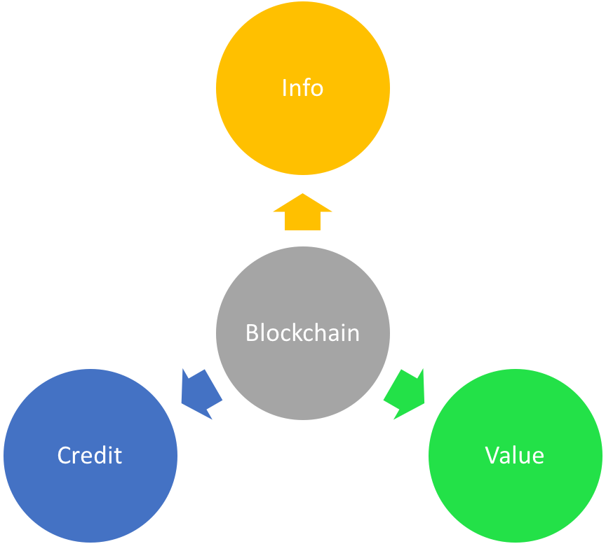

## 商业价值

现代商业的典型模式为，交易方通过协商和执行合约，完成交易过程。区块链擅长的正是如何管理合约，确保合约的顺利执行。

根据类别和应用场景不同，区块链所体现的特点和价值也不同。

从技术特点上，区块链一般被认为具有：

* 分布式容错性：网络极其鲁棒，容错 1/3 左右节点的异常状态。
* 不可篡改性：一致提交后的数据会一直存在，不可被销毁或修改。
* 隐私保护性：密码学保证了未经授权者能访问到数据，但无法解析。

随之带来的业务特性将可能包括：

* 可信任性：区块链机制提供天然的可信任保证，不需要第三方中介机构。 
* 降低成本：跟传统技术相比，区块链技术可能带来更短的时间成本、更少的人力成本。
* 增强安全：区块链技术将有利于安全可靠的审计管理和账目清算，降低各种风险。

区块链并非凭空诞生的新技术，更像是技术演化到一定程度突破应用阈值后的产物，因此，其商业应用场景也跟促生其出现的环境息息相关。基于区块链技术，任何基于数字交易的活动成本和追踪成本都会降低，并且能提高安全性。笔者认为，**能否最终带来成本的降低，将是一项技术能否被深入应用的关键**。

笔者认为，所有跟信息、价值（包括货币、证券、专利、版权、数字商品、实际物品等）、信用等相关的交换过程，都将可能从区块链技术中得到启发或直接受益。

目前，区块链技术已经得到了众多金融机构和商业公司的关注。

已经对区块链技术进行投入或应用的金融机构（排名不分先后）目前有：

* Visa
* 美国纳斯达克证券交易所（Nasdaq）
* 高盛投资银行（Goldman Sachs）
* 花旗银行（citibank）
* 美国富国银行（Wells Fargo）
* 中国央行
* 中国浦发银行
* 日本三菱日联金融集团
* 瑞士联合银行
* 德意志银行
* DTCC
* SWIFT

部分商业、技术公司包括：

* IBM
* 微软
* Intel
* 思科（Cisco）
* 埃森哲
