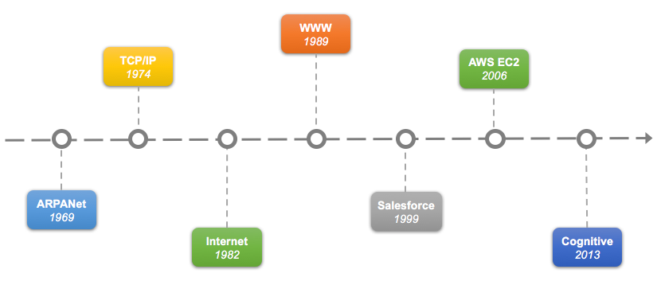

## 何去何从

关于区块链的探讨和争论从未停息。

或许从计算技术的演变历史中能得到一些启发意义。

上图是笔者在某次交流会中提出的。

以云计算为代表的现在计算技术，发展历史上有若干重要的时间点和事件：

* 1969 - ARPANet（Advanced Research Projects Agency Network）：现代互联网的前身，被美国高级研究计划署（Advanced Research Project Agency）提出，其使用 NCP 协议，核心缺陷之一是无法做到和个别计算机网络交流；
* 1973 - TCP/IP：Vinton.Cerf（文特•瑟夫）与Bob Karn（鲍勃•卡恩）共同开发出 TCP 模型，解决了 NCP 的缺陷；
* 1982 - Internet：TCP/IP 正式成为规范，并被大规模应用，现代互联网诞生；
* 1989 - WWW：早期互联网的应用主要包括 telnet、ftp、email 等，蒂姆·伯纳斯-李（Tim Berners-Lee）设计的 WWW 协议成为互联网的杀手级应用，引爆了现代互联网，从那开始，互联网业务快速扩张；
* 1999 - salesforge：互联网出现后，一度只能进行通信应用，但 salesforge 开始以云的理念提供基于互联网的企业级服务；
* 2006 - aws ec2：AWS EC2 奠定了云计算的业界标杆，直到今天，竞争者们仍然在试图追赶 AWS 的脚步；
* 2013 - cognitive：以 IBM Watson 为代表的认知计算开始进入商业领域，计算开始变得智能，进入“后云计算时代”。

从这个历史中能看出哪些端倪呢？

一个是 **技术领域也存在着周期律。** 这个周期目前看是 7-8 年左右。或许正如人有“七年之痒”，技术也存在着七年这道坎，到了这道坎，要么自身突破迈过去，要么往往就被新的技术所取代。如果从比特币网络上线（2009 年 1 月）算起，到今年正是在坎上。因此，现在正是相关技术进行突破的好时机。

*为何恰好是 7 年？7 年按照产品周期来看基本是 2-3 个产品周期，所谓事不过三，经过 2-3 个产品周期也差不多该有个结论了。*

另外，**先出现的未必是先驱，也可能是先烈。** 创新固然很好，但过早播撒的种子，没有合适的土壤，往往也难长大。技术创新与科研创新很不同的一点便是，技术创新必须立足于需求，过早过晚都会错失良机。科研创新则要越早越好，最好像二十世纪那批物理巨匠们一样，让后人吃了一百多年的老本。

最后，**事物的发展往往是延续的、长期的。** 新生事物大都不是凭空蹦出来的，往往是解决了前辈未能解决的问题，或是出现了之前未曾出现过的场景。而且很多时候，新生事物会在历史的舞台下面进行长期的演化，只要是往提高生产力的正确方向，迟早会有出现在舞台上的一天。

目前，区块链在数字货币领域（以比特币为代表）的应用已经相对成熟，而在智能合约方向尚处于初步实践阶段。区块链技术的应用已经在许多领域都带来了生产力提升，笔者相信，随着技术进一步的发展，区块链将会促进金融和信息科技走向新的阶段。
